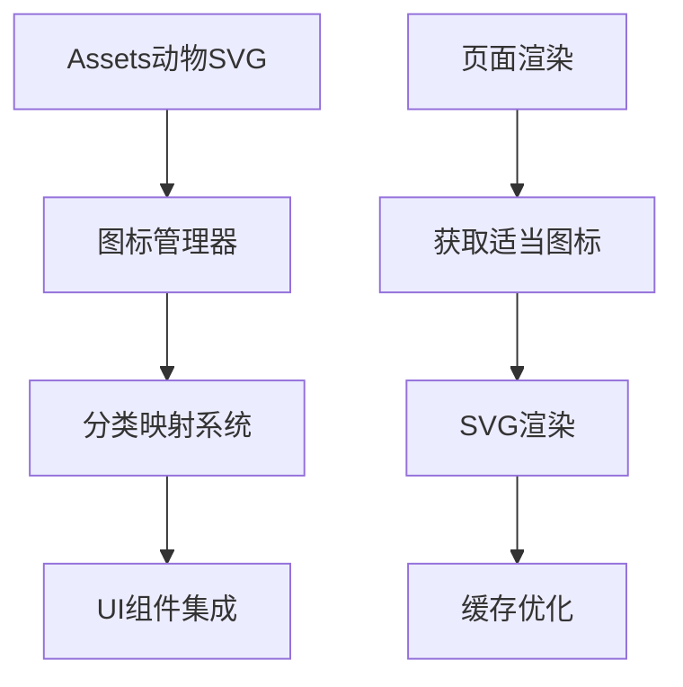

# Design Document

## Overview

本设计文档详细描述了PurrseLog应用的两个主要增强功能：动态版本信息显示和动物图标装饰系统。这些功能将提升用户体验，使应用更加生动有趣，同时保持专业的功能性。

### 核心目标

- 实现从pubspec.yaml动态读取版本信息并在设置页面显示
- 使用assets中的动物SVG图标装饰整个应用界面
- 保持现有UI设计风格的一致性
- 确保性能优化和良好的用户体验

## Architecture

### 版本信息管理架构

```mermaid
graph TD
    A[应用启动] --> B[PackageInfo.fromPlatform()]
    B --> C[获取版本信息]
    C --> D[存储在全局状态]
    D --> E[设置页面显示]
    
    F[构建脚本] --> G[更新pubspec.yaml]
    G --> H[自动反映到应用]
```

### 动物图标系统架构



## Components and Interfaces

### 1. 版本信息组件

#### VersionService

```dart
class VersionService {
  static PackageInfo? _packageInfo;
  
  static Future<void> initialize() async {
    _packageInfo = await PackageInfo.fromPlatform();
  }
  
  static String get version => _packageInfo?.version ?? 'Unknown';
  static String get buildNumber => _packageInfo?.buildNumber ?? 'Unknown';
  static String get appName => _packageInfo?.appName ?? 'PurrseLog';
  static String get packageName => _packageInfo?.packageName ?? 'Unknown';
  
  static String get formattedVersion => 'v${version}+${buildNumber}';
}
```

#### VersionDisplay Widget

```dart
class VersionDisplay extends StatelessWidget {
  final bool showBuildNumber;
  final TextStyle? textStyle;
  
  const VersionDisplay({
    Key? key,
    this.showBuildNumber = true,
    this.textStyle,
  }) : super(key: key);
  
  @override
  Widget build(BuildContext context) {
    return Container(
      padding: const EdgeInsets.symmetric(horizontal: 8, vertical: 4),
      decoration: BoxDecoration(
        color: const Color(0xFF4CAF50).withValues(alpha: 0.2),
        borderRadius: BorderRadius.circular(6),
      ),
      child: Text(
        VersionService.formattedVersion,
        style: textStyle ?? const TextStyle(
          fontSize: 12,
          color: Color(0xFF4CAF50),
          fontWeight: FontWeight.w600,
        ),
      ),
    );
  }
}
```

### 2. 动物图标系统

#### AnimalIconManager

```dart
class AnimalIconManager {
  static const Map<String, String> _categoryIcons = {
    '餐饮': 'assets/白猫.svg',
    '交通': 'assets/柴犬.svg',
    '购物': 'assets/布偶猫.svg',
    '娱乐': 'assets/哈士奇.svg',
    '医疗': 'assets/蓝猫.svg',
    '教育': 'assets/边牧.svg',
    '住房': 'assets/金毛.svg',
    '工资': 'assets/三花猫.svg',
    '奖金': 'assets/奶牛猫.svg',
    '投资': 'assets/暹罗猫.svg',
    '兼职': 'assets/柯基.svg',
    '礼金': 'assets/田园犬.svg',
  };
  
  static const List<String> _decorativeIcons = [
    'assets/仓鼠.svg',
    'assets/可达鸭.svg',
    'assets/荷兰猪.svg',
    'assets/法斗.svg',
    'assets/腊肠犬.svg',
    'assets/藏獒.svg',
    'assets/黑猫.svg',
  ];
  
  static String getIconForCategory(String category) {
    return _categoryIcons[category] ?? 'assets/白猫.svg';
  }
  
  static String getRandomDecorative() {
    final random = Random();
    return _decorativeIcons[random.nextInt(_decorativeIcons.length)];
  }
  
  static List<String> getAllIcons() {
    return [..._categoryIcons.values, ..._decorativeIcons];
  }
}
```

#### AnimalIcon Widget

```dart
class AnimalIcon extends StatelessWidget {
  final String iconPath;
  final double size;
  final Color? color;
  final bool enableAnimation;
  
  const AnimalIcon({
    Key? key,
    required this.iconPath,
    this.size = 24,
    this.color,
    this.enableAnimation = false,
  }) : super(key: key);
  
  @override
  Widget build(BuildContext context) {
    Widget icon = SvgPicture.asset(
      iconPath,
      width: size,
      height: size,
      colorFilter: color != null 
        ? ColorFilter.mode(color!, BlendMode.srcIn)
        : null,
    );
    
    if (enableAnimation) {
      return TweenAnimationBuilder<double>(
        tween: Tween(begin: 0.8, end: 1.0),
        duration: const Duration(milliseconds: 300),
        builder: (context, scale, child) {
          return Transform.scale(
            scale: scale,
            child: icon,
          );
        },
      );
    }
    
    return icon;
  }
}
```

### 3. 页面集成组件

#### DecoratedCard Widget

```dart
class DecoratedCard extends StatelessWidget {
  final Widget child;
  final String? animalIcon;
  final bool showRandomAnimal;
  
  const DecoratedCard({
    Key? key,
    required this.child,
    this.animalIcon,
    this.showRandomAnimal = false,
  }) : super(key: key);
  
  @override
  Widget build(BuildContext context) {
    final iconPath = animalIcon ?? 
      (showRandomAnimal ? AnimalIconManager.getRandomDecorative() : null);
    
    return Card(
      elevation: 4,
      shadowColor: Colors.cyan.withValues(alpha: 0.2),
      shape: RoundedRectangleBorder(
        borderRadius: BorderRadius.circular(12),
      ),
      child: Stack(
        children: [
          child,
          if (iconPath != null)
            Positioned(
              top: 8,
              right: 8,
              child: Opacity(
                opacity: 0.3,
                child: AnimalIcon(
                  iconPath: iconPath,
                  size: 32,
                  color: const Color(0xFF00BCD4),
                ),
              ),
            ),
        ],
      ),
    );
  }
}
```

## Data Models

### VersionInfo Model

```dart
class VersionInfo {
  final String version;
  final String buildNumber;
  final String appName;
  final String packageName;
  final DateTime buildDate;
  
  const VersionInfo({
    required this.version,
    required this.buildNumber,
    required this.appName,
    required this.packageName,
    required this.buildDate,
  });
  
  String get formattedVersion => 'v$version+$buildNumber';
  
  factory VersionInfo.fromPackageInfo(PackageInfo packageInfo) {
    return VersionInfo(
      version: packageInfo.version,
      buildNumber: packageInfo.buildNumber,
      appName: packageInfo.appName,
      packageName: packageInfo.packageName,
      buildDate: DateTime.now(), // 可以从构建时间获取
    );
  }
}
```

### AnimalIconConfig Model

```dart
class AnimalIconConfig {
  final String name;
  final String assetPath;
  final IconCategory category;
  final Color? defaultColor;
  
  const AnimalIconConfig({
    required this.name,
    required this.assetPath,
    required this.category,
    this.defaultColor,
  });
}

enum IconCategory {
  expense,      // 支出相关
  income,       // 收入相关
  decorative,   // 装饰性
  functional,   // 功能性
}
```

## Error Handling

### 版本信息错误处理

1. **PackageInfo获取失败**
   - 显示默认版本信息
   - 记录错误日志
   - 提供重试机制

2. **版本格式异常**
   - 使用fallback格式
   - 显示用户友好的错误信息

### 动物图标错误处理

1. **SVG加载失败**
   - 使用默认图标替代
   - 优雅降级到文字或Material图标
   - 缓存失效时的重新加载

2. **内存管理**
   - 图标缓存策略
   - 大量图标时的懒加载
   - 内存压力时的资源释放

## Testing Strategy

### 单元测试

1. **VersionService测试**

   ```dart
   group('VersionService', () {
     test('should initialize with package info', () async {
       await VersionService.initialize();
       expect(VersionService.version, isNotEmpty);
     });
     
     test('should format version correctly', () {
       expect(VersionService.formattedVersion, matches(r'v\d+\.\d+\.\d+\+\d+'));
     });
   });
   ```

2. **AnimalIconManager测试**

   ```dart
   group('AnimalIconManager', () {
     test('should return correct icon for category', () {
       final icon = AnimalIconManager.getIconForCategory('餐饮');
       expect(icon, equals('assets/白猫.svg'));
     });
     
     test('should return random decorative icon', () {
       final icon = AnimalIconManager.getRandomDecorative();
       expect(icon, contains('assets/'));
     });
   });
   ```

### Widget测试

1. **VersionDisplay Widget测试**

   ```dart
   testWidgets('VersionDisplay shows formatted version', (tester) async {
     await tester.pumpWidget(
       MaterialApp(home: VersionDisplay()),
     );
     
     expect(find.textContaining('v'), findsOneWidget);
   });
   ```

2. **AnimalIcon Widget测试**

   ```dart
   testWidgets('AnimalIcon renders SVG correctly', (tester) async {
     await tester.pumpWidget(
       MaterialApp(
         home: AnimalIcon(iconPath: 'assets/白猫.svg'),
       ),
     );
     
     expect(find.byType(SvgPicture), findsOneWidget);
   });
   ```

### 集成测试

1. **版本信息端到端测试**
   - 验证设置页面显示正确版本
   - 测试版本更新后的自动反映

2. **动物图标集成测试**
   - 验证不同页面的图标显示
   - 测试图标与UI元素的协调性

### 性能测试

1. **图标加载性能**
   - 测量SVG渲染时间
   - 内存使用情况监控

2. **版本信息获取性能**
   - PackageInfo初始化时间
   - 应用启动时间影响

## Implementation Considerations

### 依赖管理

- 添加`package_info_plus: ^8.0.2`到pubspec.yaml
- 确保`flutter_svg: ^2.0.9`版本兼容性

### 平台特定考虑

1. **Android**
   - 确保compileSdk版本兼容
   - 处理权限相关问题

2. **iOS**
   - Info.plist配置
   - 版本号格式处理

3. **Web**
   - version.json文件生成
   - CORS配置考虑

### 性能优化

1. **图标缓存策略**
   - 使用Flutter的图片缓存机制
   - 预加载常用图标

2. **懒加载实现**
   - 按需加载装饰性图标
   - 减少初始化时间

### 可维护性

1. **配置文件管理**
   - 图标映射配置外部化
   - 版本显示格式可配置

2. **扩展性设计**
   - 支持动态添加新图标
   - 版本信息展示的自定义化
